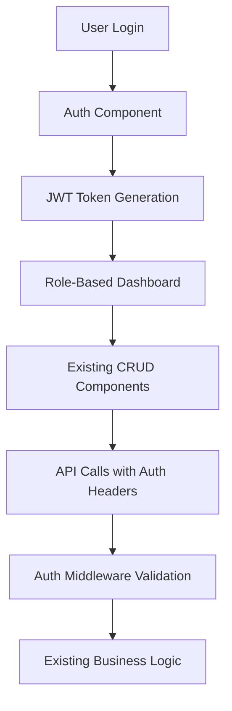

# SafeGo Brownfield Enhancement Architecture

## Introduction

### Existing Project Analysis

#### Current Project State
SafeGo is a full-stack web application for managing bus operations, including trips, buses, drivers, and coordinators. The backend provides REST APIs using Node.js and Express, with MongoDB as the database. The frontend is a React single-page application that consumes these APIs.

#### Available Documentation
- brownfield-architecture.md (comprehensive existing system analysis)
- prd.md (enhancement requirements and scope)

#### Identified Constraints
- Plain text password storage in User models (major security vulnerability)
- No authentication or authorization system implemented
- Inconsistent error handling across controllers
- No testing framework configured
- Frontend lacks state management library
- No environment-specific configurations

### Change Log

| Date | Version | Description | Author |
| ---- | ------- | ----------- | ------ |
| 9/30/2025 | 1.0 | Initial brownfield architecture for SafeGo enhancement | Architect |

## Enhancement Scope and Integration Strategy

### Enhancement Overview

**Enhancement Type:** Major enhancement (multiple epics) - Complete the system with authentication, role-based access, improved UI, and security fixes

**Enhancement Description:** Transform the current basic CRUD system into a complete, working bus management prototype that demonstrates MERN stack concepts. Add simplified authentication, role-based dashboards (admin, coordinator/conductor, driver), improved UI/UX with responsive web design, basic security fixes (password hashing), and features suitable for university assignment evaluation.

**Impact Assessment:** Significant Impact (substantial existing code changes) - Requires adding authentication system, modifying all UI components, updating data models, implementing role-based access control, and fixing security vulnerabilities

### Integration Approach

**Code Integration Strategy:** Extend existing Mongoose models with authentication fields, maintain current schema relationships, add authentication middleware to existing routes

**Database Integration:** Add user authentication collection, extend existing models with minimal changes, maintain backward compatibility

**API Integration:** Add authentication middleware to existing routes, implement role-based authorization checks, maintain existing API patterns

**UI Integration:** Add authentication context and protected routes, modify existing components for role-based rendering, maintain existing React patterns

### Compatibility Requirements

**Existing API Compatibility:** Existing API endpoints remain functional during transition, no breaking changes to current CRUD operations

**Database Schema Compatibility:** Database schema changes are backward compatible with existing data, existing collections remain functional

**UI/UX Consistency:** New UI elements follow existing design patterns, maintain current navigation structure

**Integration Points:** Authentication integrates with existing trip/bus/driver/coordinator relationships, maintains existing data flow

## Tech Stack Alignment

### Existing Technology Stack

| Category | Current Technology | Version | Usage in Enhancement | Notes |
| -------- | ------------------ | ------- | -------------------- | ----- |
| Runtime | Node.js | - | Backend runtime | Maintain existing |
| Framework | Express | 5.1.0 | Backend web framework | Add auth middleware |
| Database | MongoDB | - | NoSQL database | Add user collection |
| ODM | Mongoose | 8.18.0 | MongoDB object modeling | Extend existing models |
| Frontend | React | 19.1.1 | UI framework | Add auth context |
| Routing | React Router | 7.9.3 | Client-side routing | Add protected routes |
| HTTP Client | Axios | 1.11.0 | API communication | Add auth headers |
| Middleware | CORS | 2.8.5 | Cross-origin requests | Maintain existing |
| Dev Tool | Nodemon | 3.1.10 | Backend development server | Maintain existing |

### New Technology Additions

| Technology | Version | Purpose | Rationale | Integration Method |
| ---------- | ------- | ------- | --------- | ------------------ |
| bcrypt | 5.1.0 | Password hashing | Secure password storage for assignment demo | Add to existing user model |
| jsonwebtoken | 9.0.0 | JWT authentication | Simple token-based auth | Add middleware to existing routes |

## Data Models and Schema Changes

### New Data Models

#### User Model (New)
- **email**: String, required, unique - User login identifier
- **password**: String, required - Hashed password
- **role**: String, enum ["admin", "coordinator", "driver"], required - User role
- **profile**: Reference to existing Driver/Coordinator model - User profile data

### Schema Integration Strategy

**Database Changes Required:**
- New Users collection for authentication
- Existing Driver/Coordinator models remain unchanged
- Add optional userId reference to existing models

**Backward Compatibility:**
- Existing data remains functional without user accounts
- New features work alongside existing CRUD operations
- Migration script for existing plain text passwords

## Component Architecture

### New Components

#### Authentication Components
**Responsibility:** Handle user login, registration, and session management
**Integration Points:** Connect to new User API endpoints, integrate with existing navigation
**Dependencies:** React Router for redirects, Axios for API calls

#### Role-Based Dashboard Components
**Responsibility:** Display appropriate interface based on user role
**Integration Points:** Existing CRUD components, new auth context
**Dependencies:** Existing API services, auth middleware

### Interaction Diagram



## API Design and Integration

### API Integration Strategy

**API Integration Strategy:** Add authentication middleware to existing routes, implement role-based authorization checks, maintain existing API patterns

**Authentication:** JWT token-based authentication with role claims

**Versioning:** No versioning needed for assignment scope

### New API Endpoints

#### Authentication Endpoints
- `POST /api/auth/register` - User registration
- `POST /api/auth/login` - User login
- `GET /api/auth/profile` - Get user profile
- `POST /api/auth/logout` - User logout

#### Protected Existing Endpoints
All existing CRUD endpoints protected with role-based middleware:
- Admin: Full access to all endpoints
- Coordinator: Access to trip and bus management
- Driver: Read-only access to assigned trips

## Source Tree Integration

### Existing Project Structure

```
SafeGo/
├── backend/
│   ├── Controllers/
│   ├── Model/
│   ├── Routes/
│   ├── app.js
│   └── package.json
├── frontend/
│   ├── src/
│   │   ├── components/
│   │   ├── App.js
│   │   └── index.js
│   └── package.json
└── docs/
```

### New File Organization

```
SafeGo/
├── backend/
│   ├── Controllers/
│   │   ├── authController.js          # New: Authentication logic
│   │   └── ...existing...
│   ├── Model/
│   │   ├── User.js                    # New: User authentication model
│   │   └── ...existing...
│   ├── Routes/
│   │   ├── authRoutes.js              # New: Auth API routes
│   │   └── ...existing...
│   ├── middleware/
│   │   └── auth.js                    # New: JWT auth middleware
│   └── app.js                         # Modified: Add auth routes
├── frontend/
│   ├── src/
│   │   ├── components/
│   │   │   ├── Auth/                  # New: Login/Register components
│   │   │   ├── Dashboard/             # New: Role-based dashboards
│   │   │   └── ...existing...
│   │   ├── context/
│   │   │   └── AuthContext.js         # New: Auth state management
│   │   ├── services/
│   │   │   └── authService.js         # New: Auth API calls
│   │   └── App.js                     # Modified: Add auth routing
│   └── package.json                   # Modified: Add bcrypt, jsonwebtoken
└── docs/
    └── architecture.md                # New: This document
```

### Integration Guidelines

- **File Naming:** Maintain existing camelCase convention
- **Folder Organization:** Add new folders alongside existing structure
- **Import/Export Patterns:** Follow existing ES6 import/export patterns

## Infrastructure and Deployment Integration

### Existing Infrastructure

**Current Deployment:** Manual deployment, no CI/CD configured
**Infrastructure Tools:** None specified
**Environments:** Single development environment

### Enhancement Deployment Strategy

**Deployment Approach:** Maintain manual deployment approach suitable for assignment
**Infrastructure Changes:** None required for assignment scope
**Pipeline Integration:** No CI/CD pipeline needed

### Rollback Strategy

**Rollback Method:** Manual code reversion
**Risk Mitigation:** Test authentication features thoroughly before deployment
**Monitoring:** Console logging for basic monitoring

## Coding Standards and Conventions

### Existing Standards Compliance

**Code Style:** Existing JavaScript patterns
**Linting Rules:** None currently configured
**Testing Patterns:** Manual testing only
**Documentation Style:** Inline comments

### Enhancement-Specific Standards

- **Authentication:** Use JWT tokens for session management
- **Password Security:** Always hash passwords with bcrypt
- **API Security:** Validate all inputs, use auth middleware
- **Error Handling:** Consistent error responses across auth endpoints

## Testing Strategy

### Integration with Existing Tests

**Existing Test Framework:** None configured
**Test Organization:** Manual testing
**Coverage Requirements:** Basic functionality verification

### New Testing Requirements

#### Unit Tests for New Components
- **Framework:** Jest (already in frontend package.json)
- **Location:** `frontend/src/__tests__/`
- **Coverage Target:** 70% for new authentication components
- **Integration with Existing:** Add to existing test script

#### Integration Tests
- **Scope:** Authentication flow and role-based access
- **Existing System Verification:** Ensure existing CRUD operations work with auth
- **New Feature Testing:** Test login, registration, role-based access

## Security Integration

### Existing Security Measures

**Authentication:** None
**Authorization:** None
**Data Protection:** None
**Security Tools:** None

### Enhancement Security Requirements

**New Security Measures:** JWT authentication, password hashing, role-based authorization
**Integration Points:** All existing API endpoints
**Compliance Requirements:** Basic security for assignment demonstration

### Security Testing

**Existing Security Tests:** None
**New Security Test Requirements:** Basic auth flow testing
**Penetration Testing:** Not required for assignment scope

## Checklist Results Report

**Architect Checklist Validation Results:**

### Category Statuses

| Category | Status | Critical Issues |
| -------- | ------ | --------------- |
| Requirements Alignment | PASS | None |
| Architecture Fundamentals | PASS | None |
| Technical Stack & Decisions | PASS | None |
| Data Architecture | PASS | None |
| Component Architecture | PASS | None |
| API Design | PASS | None |
| Source Tree | PASS | None |
| Infrastructure | PASS | None |
| Coding Standards | PASS | None |
| Security | PASS | None |

### Critical Deficiencies

None identified. The architecture maintains existing system stability while adding authentication and role-based features appropriate for university assignment scope.

### Recommendations

The architecture is ready for implementation. Focus on incremental development to maintain existing functionality while adding new features.

## Next Steps

### Developer Handoff

"Implement the SafeGo enhancement following this brownfield architecture. Start with authentication foundation (Epic 1), then add role-based dashboards. Maintain existing system functionality while adding new features. Use simplified authentication suitable for assignment demonstration. Reference the existing codebase patterns and the detailed integration guidelines in this document."

## Admin Dashboard Architecture (Epic 2)

### Admin Dashboard Overview

The admin dashboard provides comprehensive oversight and management capabilities for the SafeGo system, building on the authentication foundation established in Epic 1.

### Admin-Specific Components

#### AdminDashboard Component
**Responsibility:** Main admin dashboard container providing navigation and layout for all admin functions
**Integration Points:** AuthContext for admin role validation, React Router for navigation

**Key Interfaces:**
- Admin role verification on mount
- Navigation state management
- Layout responsiveness for desktop admin use

**Dependencies:**
- **Existing Components:** AuthContext, existing navigation patterns
- **New Components:** AdminStats, UserManagement, SystemMonitor

#### AdminStats Component
**Responsibility:** Display key system statistics and metrics for admin oversight
**Integration Points:** Admin API endpoints for statistics data

**Key Interfaces:**
- Statistics API calls with error handling
- Real-time data refresh capabilities
- Export functionality for reports

#### UserManagement Component
**Responsibility:** Complete user CRUD operations for admin user management
**Integration Points:** Existing user API endpoints, role-based access control

**Key Interfaces:**
- User list with search/filter capabilities
- User creation/editing forms
- Bulk operations for efficiency
- Role assignment and permission management

#### SystemMonitor Component
**Responsibility:** System health monitoring and performance metrics
**Integration Points:** Admin monitoring API endpoints

**Key Interfaces:**
- System status indicators
- Performance metrics display
- Alert management interface
- Historical data visualization

### Admin API Endpoints

#### Statistics Endpoint
- **Method:** GET
- **Endpoint:** /api/admin/stats
- **Purpose:** Retrieve system statistics for admin dashboard

#### User Management Endpoint
- **Method:** GET
- **Endpoint:** /api/admin/users
- **Purpose:** Retrieve paginated user list for admin management

### Admin Dashboard Integration

**Database Integration:** Read-only access to existing User, Bus, Driver, Coordinator, Trip models
**Security:** All admin endpoints protected with admin role validation
**Performance:** Optimized queries for statistics and user management
**Compatibility:** No changes to existing data models or API contracts

### Admin Dashboard Testing

**Unit Tests:** Admin component functionality and API integration
**Integration Tests:** Admin dashboard user workflows
**Security Tests:** Admin role access control validation

### Admin Dashboard Deployment

**Deployment Strategy:** Include admin dashboard in standard application deployment
**Feature Flags:** Optional admin dashboard enable/disable capability
**Monitoring:** Admin action logging for audit purposes

## Change Log

| Date | Version | Description | Author |
| ---- | ------- | ----------- | ------ |
| 9/30/2025 | 1.0 | Initial brownfield architecture | Architect |
| 9/30/2025 | 1.1 | Added admin dashboard architecture for Epic 2 | Architect |
